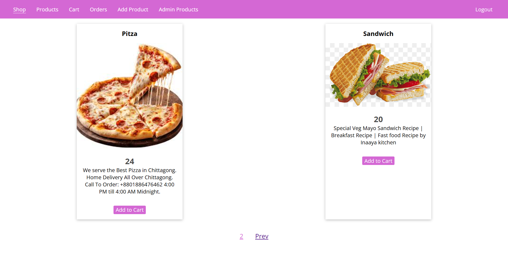
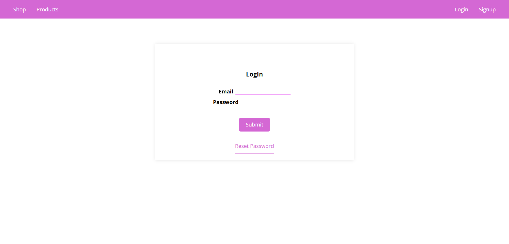

# FOODIE
####  A full-stack e-commerce web application built with Node.js, Express, MongoDB, EJS, and Stripe. This project supports product management, cart functionality, secure checkout with Stripe, order creation, and invoice generation.

## Features 

- Secure data 
- Mongo DB database 
- User authentication & session handling
- Product listing with pagination
- MVC architecture 
- Image upload for products 
- CSRF protection
- Shopping cart (add / remove products)
- Secure checkout using Stripe
- Order creation after successful payment
- PDF invoice generation for orders

## Tech Stack 

- **Backend:** Node.js, Express.js  
- **Frontend:** EJS, CSS  
- **Database:** MongoDB + Mongoose  
- **Payments:** Stripe Checkout  
- **Authentication:** Sessions  
- **PDF Generation:** pdfkit  

## Project Structure 
<code>
express/
│── controllers/
│   └── shop.js
│
│── models/
│   ├── product.js
│   ├── user.js
│   └── order.js
│
│── routes/
│   └── shop.js
│
│── views/
│   ├── shop/
│   ├── admin/
│   └── includes/
│
│── public/
│   ├── css/
│   └── js/
│
│── images/
│── data/
│── app.js
│── package.json
</code>

## Future Improvements

- User roles (admin / customer)
- Product categories
- Email confirmations
- Better error UI
- Deployment (Render / Railway / Vercel)

## Built with persistence, debugging pain, and a lot of learning by Tamana 💖👩‍💻

